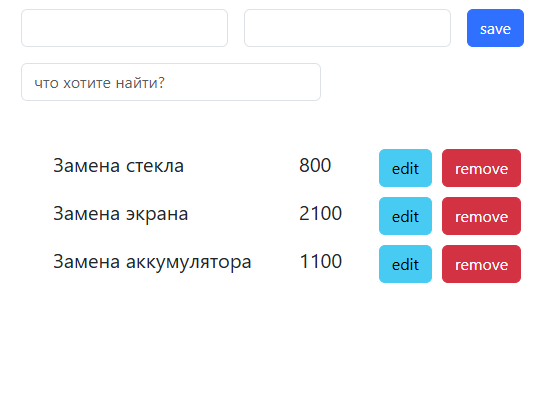
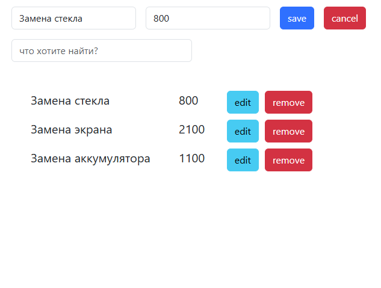

# Project

1. По умолчанию показывается форма добавления, при заполнении и нажатии на кнопку **save** происходит добавление элемента в список:

2. При нажатии на кнопку **edit** форма автоматически заполняется данными элемента:

Далее возможны два сценария:

-  Если пользователь нажал на кнопку **save**, запись в таблице обновляется.

-  Если пользователь нажал на кнопку **cancel**, то поля вычищаются и снова отображается форма добавления.
